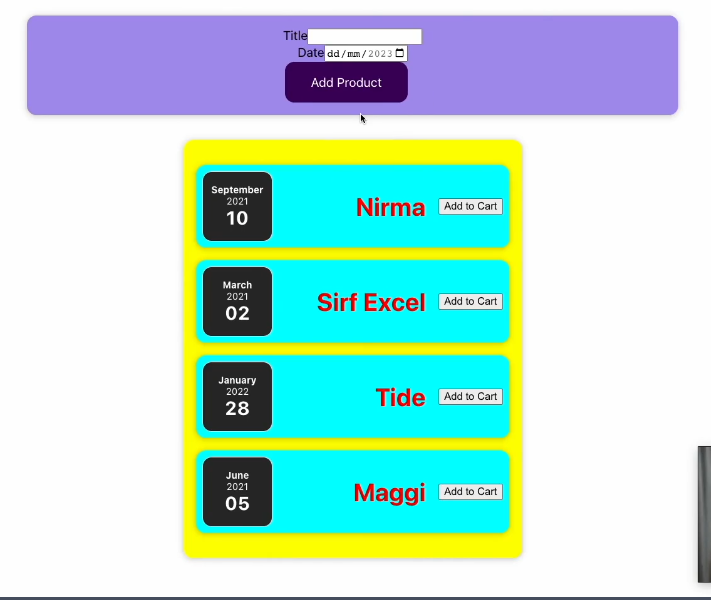
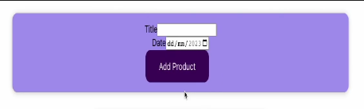
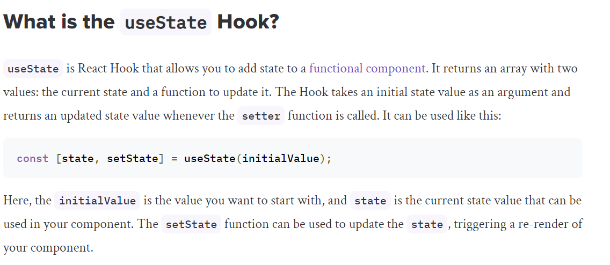

<div class="hearder"> 
   
   <h1 class="Lecture-name" style= "text-align:center; color:rgb(247,65,143);"> Lecture-2 </h1>
  
</div>


<div style="margin-top:30px;"> 
  
</div>

<div class="Project-heading" style="margin-top:30px;">

  1. In this Lecture we will learn how to add <b style="color:rgb(76, 205, 153)"> "New Product" </b>  in the given table.
  2. We will create one <b style="color:rgb(0, 141, 218)" >"ProductForm Component"</b> and one <b style="color:rgb(0, 141, 218)" >"NewProduct Component"</b>. Using these two Component we will add new Product in the Table.
</div>


<div class="Project-img" style="margin-left:70px;">
   
</div>

<div>

3.  For implementing the above project we have done all the table related codes and till now we have many files like - <b style="color:rgb(76, 205, 153)">card.js , ProductDate.js , ProductItem.js , Products.js , App.js</b> including its css file.
4.  And for adding NewItem we have two new components that are  <b style="color:rgb(0, 141, 218)" >"NewProduct"</b> and <b style="color:rgb(0, 141, 218)" >"ProductForm"</b>. In this two file we will do code from initial and in rest file we will make any update if needed.

</div>

<div class="Project-heading" style="margin-top:30px;">

<div style="text-align:center;color:rgb(139, 147, 255)">                                 
 Page 0
</div>

<h1> </h1>                                                                                                                                                 <!-- page 0 ends-->

<br>

<div style="margin-left:20px">

<b style="font-size:20px;color:rgb(247,65,143)">For adding NewProduct we have to create one form.</b>
<div class="Project-img" style="margin-left:33px;">


</div>

- For creating this form we have to follow this steps :-
<div style="margin-left:15px">

1. Make NewProduct Component and ProductForm Component File.
2. Render ProductForm Component in NewProduct Component.
3. To display Form on UI, render NewProduct Component in App.js 
</div>


<div style="margin-left:20px">
<br>
1. <b style="color:rgb(76, 205, 153)">NewProduct.js</b>

```js
import './NewProduct.css'
import ProductForm from './ProductForm';

function NewProduct() {

   return (<div>
        <ProductForm/>          {/* 2. Remderimg ProductForm component in NewProduct compo*/}  
       </div>)
}

export default NewProduct;

```

</div>

<div style="margin-left:20px">
<b style="color:rgb(76, 205, 153)">ProductForm.js</b>

```js
import './ProductForm'

function ProductForm(){

   return (<form>                                       {/*  form tag  */}
        <div className='new-product_title'>   
            <label>Title</label>
            <input type='text' </input>  
        </div>
        <div className='new-product_date'>
            <label>Date</label>
            <input type='date'  min='2023-01-01' max='2023-12-12'></input>
        </div>
        <div className='new-product_button'>
            <button type='submit'>Add Product</button>
        </div>

    </form>)
}

export default ProductForm;
```
</div>


<div style="margin-left:20px">
<b style="color:rgb(76, 205, 153)">3. To display Form on UI, render NewProduct Component in App.js </b>

```js
import React from "react";
import Products from './components/Products';
import NewProduct from "./components/NewProduct";

const App = () => {
  const products = [
    {
      id:'p1',
      title:'Nirma',
      amount: 100,
      date:new Date(2001, 8, 11),
    },

    {
      id:'p2',
      title:'Ghadi',
      amount: 150,
      date:new Date(2005, 8, 10),
    },

    {
      id:'p3',
      title:'Sirf Exel',
      amount: 300,
      date:new Date(2008, 4, 8),
    },

    {
      id:'p4',
      title:'Wahil',
      amount: 200,
      date:new Date(2007, 3, 9),
    },
  ];

  return(
    <div>
      <NewProduct/>                     {/*  Here NewProduct component is rendered  */}
      <Products items={products}/>
    </div>
  );
};

export default App;

```


<div style="text-align:center;color:rgb(139, 147, 255)">                   
 Page 1
</div>

<h1> </h1>                                        <!-- page 1 ends-->
<br>

<div style="margin-left:-2px">
<b style="font-size:20px;color:rgb(247,65,143)">Till now we have made our form and made visible on UI but now the question is how to add new product in the table using the form what will be the logic.</b>

<br>
<div class="Project-img" style="margin-left:33px;">


</div>

- We have Form, Logic of adding new product in the table are in the following steps :-
<div style="margin-left:15px">

1. How we can find <b>current text</b> in the input field Title and Date in the Form.
2. How we will execute <b>onChange Props (same as event handler in js)</b> for finding current text in the input field using default object <b>event</b> .
3. Which functionalities (logic) will be added on button if button is clicked, for adding new product present in the input filed .
</div>


<div style="margin-left:20px">
1. <b style="color:rgb(76, 205, 153)"> How we can find current text in the input field Title and Date in the Form  </b>

- Using <b>onChange</b> props and default object <b>event</b> we can   find current text in the input field.

#### 2. <b style="color:rgb(76, 205, 153)"> How we will execute <b>onChange Props (same as event handler in js)</b> for finding current text in the input field using default object <b>event</b> </b>

- first we will include onChange props in the input and make handler function after that we will pass event in the parameter of handler, using default object "event" we can read text in the input field.

- Here setTitle and setDate functions will not change the value of input on the spot, it will schedule and then change. 

- Here setTitle and setDate will store input in newTitle and newDate using <b>useState Hooks</b>.

<div class="Project-img" style="margin-left:33px;">


</div>

- Here we have also mapped newTitle with Title input field UI, and newDate with Date input field UI using vlaue props.

<div style="margin-left:20px">
<b style="color:rgb(76, 205, 153)">ProductForm.js</b>

```js
import { useState } from 'react';
import './ProductForm'

function ProductForm() {                                  {/*fn for form*/}

    const [newTitle, setTitle] = useState('');          {/*useState hooks*/}
    const [newDate, setDate] = useState('');

    function titleChangeHandler(event) {                 {/*handler fn for Title*/}
        setTitle(event.target.value);
        
    }
    function dateChangeHandler(event) {                   {/*handler fn for Date */}
        setDate(event.target.value);
    }

     return (<form>                        {/*  form for adding new product  */}
    <div className='new-product_controls'>
        <div className='new-product_control'>   
            <label>Title</label>
            <input type='text' value={newTitle} onChange={titleChangeHandler}></input> 
                              {/* here onChange is a props */}

        </div>
        <div className='new-product_control'>
            <label>Date</label>
            <input type='date' value={newDate} onChange={dateChangeHandler} min='2023-01-01' max='2023-12-12'></input>
        </div>
        <div className='new-product_button'>
            <button type='submit'>Add Product</button>
        </div>
    </div>


    </form>)
}

export default ProductForm;
```

#### 3. <b style="color:rgb(76, 205, 153)">Which functionalities (logic) will be added on button if button is clicked, for adding new product present in the input filed.</b>

- First thing is to remove default behaviour of button and then in place of default behviour of button we will create an object which will store input present in the input field(we have stored input in newTitle and newDate so we will use this).

- After taking data form input field we will clear newTitle and newDate  using setTitle(" ") and setDate(" "), this is mapped with value props in input tag so UI will also get clear.


</div>

<div style="margin-left:20px">
<b style="color:rgb(76, 205, 153)">ProductForm.js</b>

```js
import { useState } from 'react';
import './ProductForm'

function ProductForm() {

    const [newTitle, setTitle] = useState('');
    const [newDate, setDate] = useState('');

    function titleChangeHandler(event) {
        setTitle(event.target.value);
        
    }
    function dateChangeHandler(event) {
        setDate(event.target.value);
    }


    function submitHandler(event) {   
        event.preventDefault();

        const productData = {         {/* object for  */}
            title:newTitle,
            date:newDate
        };

      
        setTitle('');          {/*will empty newTitle */}
        setDate('');           {/*will empty newDate */}
    }

    return (<form onSubmit={submitHandler}>    {/*on clicking submit button submithandler fn will run*/}
    <div className='new-product_controls'>
        <div className='new-product_control'>   
            <label>Title</label>
            <input type='text' value={newTitle} onChange={titleChangeHandler}></input>  
        </div>
        <div className='new-product_control'>
            <label>Date</label>
            <input type='date' value={newDate} onChange={dateChangeHandler} min='2023-01-01' max='2023-12-12'></input>
        </div>
        <div className='new-product_button'>
            <button type='submit'>Add Product</button>
        </div>
    </div>


    </form>)
}

export default ProductForm;
```
</div>


#### 4. <b style="color:rgb(76, 205, 153)">We have done all the logic related to adding new product in the table and now last thing is how to show added item on UI.</b>

- First thing is to remove default behaviour of button and then in place of default behviour of button we will create an object which will store input present in the input field(we have stored input in newTitle and newDate so we will use this).


```js
import React from "react";
import Products from './components/Products';
import NewProduct from "./components/NewProduct";

const App = () => {
  const products = [
    {
      id:'p1',
      title:'Nirma',
      amount: 100,
      date:new Date(2001, 8, 11),
    },

    {
      id:'p2',
      title:'Ghadi',
      amount: 150,
      date:new Date(2005, 8, 10),
    },

    {
      id:'p3',
      title:'Sirf Exel',
      amount: 300,
      date:new Date(2008, 4, 8),
    },

    {
      id:'p4',
      title:'Wahil',
      amount: 200,
      date:new Date(2007, 3, 9),
    },
  ];

  return(
    <div>
      <NewProduct/>                     {/*  Here NewProduct component is rendered  */}
      <Products items={products}/>
    </div>
  );
};

export default App;

```

<div style="text-align:center;color:rgb(139, 147, 255)">                   <!-- page 2 ends -->
 Page~2
</div>

<h1> </h1>


